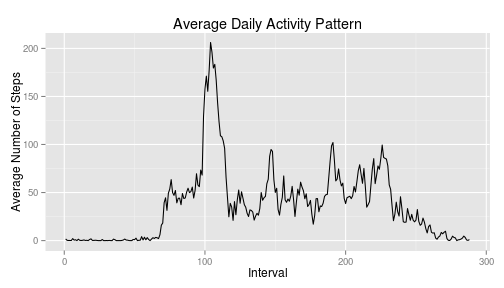
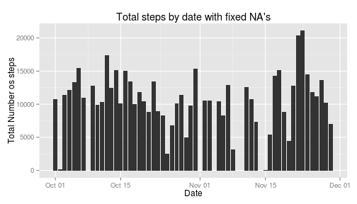
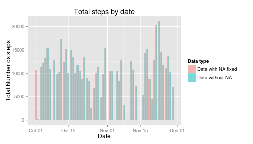
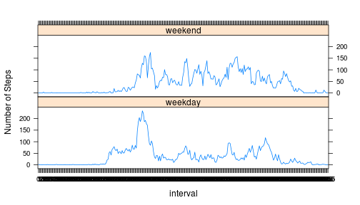
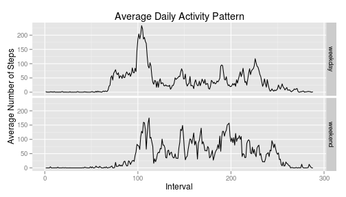

# Introduction

This assignment makes use of data from a personal activity monitoring device. This device collects
data at 5 minute intervals through out the day. The data consists of two months of data from an
anonymous individual collected during the months of October and November, 2012 and include the
number of steps taken in 5 minute intervals each day.

The data set is included in the source as "activity.zip".
The variables included in this dataset are:

- **steps:** Number of steps taking in a 5-minute interval (missing values are coded as `NA` )
- **date:** The date on which the measurement was taken in YYYY-MM-DD format
- **interval:** Identifier for the 5-minute interval in which measurement was taken

The dataset is stored in a comma-separated-value (CSV) file and there are a total of 17,568
observations in this dataset.

## Loading and preprocessing the data

**1. Unzip file "activity.zip"**

```r
if(!file.exists("activity.csv")){
        ## extract the zip file
        unzip("activity.zip", overwrite = TRUE)
}
```

**2. Read the data**

```r
df<-read.csv("activity.csv",header=TRUE, as.is = TRUE, comment.char = "", na.strings = c("NA"),
               colClasses = c("integer", "Date", "integer"), nrows = 17568)
```
**3. Process/transform the data into a format suitable for analysis**

```r
## Convert 'interval' column to a factor variable
df$interval<-factor(df$interval)
## Clean rows that do not have data on a particular interval
good<-complete.cases(df)
df_no_NA<-df[good,]
```
**4. Inspect the data**

```r
str(df_no_NA)
```

```
## 'data.frame':	15264 obs. of  3 variables:
##  $ steps   : int  0 0 0 0 0 0 0 0 0 0 ...
##  $ date    : Date, format: "2012-10-02" "2012-10-02" ...
##  $ interval: Factor w/ 288 levels "0","5","10","15",..: 1 2 3 4 5 6 7 8 9 10 ...
```

**5. Install required packages for analysis**


```r
## Install required packages for plotting
if (!require("ggplot2")) {
        install.packages("ggplot2")
}
require("ggplot2")
```
## What is mean total number of steps taken per day?

**1. Make a histogram of the total number of steps taken each day**

Calculate total number of steps taken each day and preview data

```r
#Aggregate data per day. We ignore the missing values in the dataset.
total_steps_per_day <- aggregate(steps ~ date, data = df_no_NA, sum)
## Preview the firt 10 rows of summary
head(total_steps_per_day,10)
```

```
##          date steps
## 1  2012-10-02   126
## 2  2012-10-03 11352
## 3  2012-10-04 12116
## 4  2012-10-05 13294
## 5  2012-10-06 15420
## 6  2012-10-07 11015
## 7  2012-10-09 12811
## 8  2012-10-10  9900
## 9  2012-10-11 10304
## 10 2012-10-12 17382
```
Plot histogram of the total number of steps taken each day

```r
hist<-ggplot(total_steps_per_day,aes(x=date,y=steps)) +
        geom_bar(stat="identity") +
        labs(x="Date", y="Total Number os steps") + 
        labs(title="Total steps by date (without NA's)")
print(hist)
```

 

**2. Calculate and report the *mean* and *median* total number of steps taken per day**


```r
s1<-summary(total_steps_per_day$steps)
s1
```

```
##    Min. 1st Qu.  Median    Mean 3rd Qu.    Max. 
##      41    8840   10800   10800   13300   21200
```

Another way to calculate mean and median is to use the `mean` and `median` R functions


```r
steps_mean<-mean(total_steps_per_day$steps)
print(steps_mean)
```

```
## [1] 10766
```

```r
steps_median<-median(total_steps_per_day$steps)
print(steps_median)
```

```
## [1] 10765
```

## What is the average daily activity pattern?

**1. Make a time series plot (i.e. `type = "l"`) of the 5-minute interval (x-axis) and the average number of steps taken, averaged across all days (y-axis)**

Calculate the average number os steps taken acrosss all days:

```r
# Calculate avegare steps by interval
avg_steps_per_interval <- aggregate(steps~interval,data=df_no_NA,FUN=mean)

#Adding columns names
colnames(avg_steps_per_interval) <- c("interval", "average_steps")

#Preview results
head(avg_steps_per_interval)
```

```
##   interval average_steps
## 1        0       1.71698
## 2        5       0.33962
## 3       10       0.13208
## 4       15       0.15094
## 5       20       0.07547
## 6       25       2.09434
```

Plot the time series with the base plot system:


```r
#ploting the average daily activity pattern 
plot(as.integer(levels(avg_steps_per_interval$interval)), 
     avg_steps_per_interval$average_steps, 
     type="l",
     xlab = "Interval", ylab = "Average Number of Steps", 
     main = "Average Daily Activity Pattern")
```

 

Plot the time series with the ggplot2 system:


```r
time_series_plot <- ggplot(avg_steps_per_interval,aes(x=as.integer(interval),y=average_steps)) +
        geom_line() +
        labs(x="Interval", y="Average Number of Steps") +
        labs(title="Average Daily Activity Pattern")
print(time_series_plot)
```

 

**2. Which 5-minute interval, on average across all the days in the dataset, contains the maximum number of steps?**


```r
df_interval_max_steps<-with(avg_steps_per_interval,avg_steps_per_interval[average_steps == max(average_steps),])
df_interval_max_steps
```

```
##     interval average_steps
## 104      835         206.2
```
So the **835** interval contains the maximun numberof steps.


## Imputing missing values

Note that there are a number of days/intervals where there are missing values (coded as NA ). The
presence of missing days may introduce bias into some calculations or summaries of the data.

**1. Calculate and report the total number of missing values in the dataset (i.e. the total number of rows with NA s)**

Reuse the `good` variable used to put the value of `complete.cases(df)`:


```r
t<-table(good)
t
```

```
## good
## FALSE  TRUE 
##  2304 15264
```
So, the number of total number of missing values in the dataset is **2304**

Another way:

For the “steps” variable:


```r
sum(is.na(as.character(df$steps)))
```

```
## [1] 2304
```

For the “date” variable:

```r
sum(is.na(as.character(df$date)))
```

```
## [1] 0
```
For the “interval” variable:

```r
sum(is.na(as.character(df$interval)))
```

```
## [1] 0
```

So, **only the *steps* variable** have missing values.

**2. Devise a strategy for filling in all of the missing values in the dataset. Missing values are replaced by the mean of that 5-minute interval.**


```r
# Create a function to get the mean steps for an interval. We reuse the `avg_steps_per_interval` object used to calculate the average number of steps by interval
getIntervalMean<-function (my_interval){
        x<-avg_steps_per_interval[avg_steps_per_interval$interval == my_interval,]
        x$average_steps
}
```


**3. Create a new dataset that is equal to the original dataset but with the missing data filled in.**

```r
# Create a copy of the original data frame
df_na_fixed<-df
# Replace the NA values by the mean for the interval
df_na_fixed$steps<-ifelse(is.na(df_na_fixed$steps),getIntervalMean(df_na_fixed$interval),df_na_fixed$steps)
#Preview the fixed data
head(df_na_fixed)
```

```
##     steps       date interval
## 1 1.71698 2012-10-01        0
## 2 0.33962 2012-10-01        5
## 3 0.13208 2012-10-01       10
## 4 0.15094 2012-10-01       15
## 5 0.07547 2012-10-01       20
## 6 2.09434 2012-10-01       25
```

```r
str(df_na_fixed)
```

```
## 'data.frame':	17568 obs. of  3 variables:
##  $ steps   : num  1.717 0.3396 0.1321 0.1509 0.0755 ...
##  $ date    : Date, format: "2012-10-01" "2012-10-01" ...
##  $ interval: Factor w/ 288 levels "0","5","10","15",..: 1 2 3 4 5 6 7 8 9 10 ...
```


**4. Make a histogram of the total number of steps taken each day and Calculate and report the mean
and median total number of steps taken per day.**

Calculate total number of steps taken each day and preview data

```r
#Aggregate data per day. We ignore the missing values in the dataset.
total_steps_per_day_na_fixed <- aggregate(steps ~ date, data = df_na_fixed, sum)
## Preview the firt 10 rows of summary
head(total_steps_per_day_na_fixed,10)
```

```
##          date steps
## 1  2012-10-01 10766
## 2  2012-10-02   126
## 3  2012-10-03 11352
## 4  2012-10-04 12116
## 5  2012-10-05 13294
## 6  2012-10-06 15420
## 7  2012-10-07 11015
## 8  2012-10-09 12811
## 9  2012-10-10  9900
## 10 2012-10-11 10304
```
Plot histogram of the total number of steps taken each day for data with NA fixed:

```r
hist2<-ggplot(total_steps_per_day_na_fixed,aes(x=date,y=steps)) +
        geom_bar(stat="identity") +
        labs(x="Date", y="Total Number os steps") + 
        labs(title="Total steps by date with fixed NA's")
print(hist2)
```

 
 
Calculate and report the *mean* and *median* total number of steps taken per day


```r
s2<-summary(total_steps_per_day_na_fixed$steps)
s2
```

```
##    Min. 1st Qu.  Median    Mean 3rd Qu.    Max. 
##      41    8860   10800   10800   13200   21200
```

Another way to calculate mean and median is to use the `mean` and `median` R functions


```r
steps_mean_na_fixed<-mean(total_steps_per_day_na_fixed$steps)
print(steps_mean_na_fixed)
```

```
## [1] 10766
```

```r
steps_median_na_fixed<-median(total_steps_per_day_na_fixed$steps)
print(steps_median_na_fixed)
```

```
## [1] 10766
```


**Do these values differ from the estimates from the first part of the assignment? What is the impact of imputing missing data on the estimates ofthe total daily number of steps?**

Comparison of `mean` and `median` in both data types  (without NA's/fixed NA's):

Summary comparison:

```r
comparison <- rbind(data_without_NA = s1, data_with_na_fixed = s2, delta = s2-s1)
comparison
```

```
##                    Min. 1st Qu. Median  Mean 3rd Qu.  Max.
## data_without_NA      41    8840  10800 10800   13300 21200
## data_with_na_fixed   41    8860  10800 10800   13200 21200
## delta                 0      20      0     0    -100     0
```

Mean an median comparison using `mean` and `median` functions:


```r
mm_no_na <- c(mean =steps_mean,median = steps_median)
mm_na_fixed<-c(mean =steps_mean_na_fixed,median = steps_median_na_fixed)
comparison2 <- rbind(data_without_NA = mm_no_na, data_with_na_fixed = mm_na_fixed, delta = mm_no_na-mm_na_fixed)
print(comparison2)
```

```
##                     mean     median
## data_without_NA    10766 10765.0000
## data_with_na_fixed 10766 10765.5943
## delta                  0    -0.5943
```

Plot both histograms (without NA's/fixed NA's) together for best comparison:


```r
total_steps_per_day_na_fixed$name <- "Data with NA fixed"
total_steps_per_day$name <- "Data without NA"
steps_per_day_comparison<-rbind(total_steps_per_day_na_fixed,total_steps_per_day)
hist3<-ggplot() +
        geom_bar(data=steps_per_day_comparison,aes(x=date,y=steps, fill=name),
                 stat="identity",alpha=0.5, position = "dodge") +
        labs(x="Date", y="Total Number os steps") + 
        labs(title="Total steps by date") +
        labs(fill="Data type")
hist3
```

 

## Are there differences in activity patterns between weekdays and weekends?

*NOTE: For this part the `weekdays()` function may be of some help here. We use the dataset with the filled-in missing values for this part.*

**1. Create a new factor variable in the dataset with two levels – “weekday” and “weekend” indicating whether a given date is a weekday or weekend day.**


```r
Sys.setlocale("LC_TIME", "C")
```

```
## [1] "C"
```

```r
## Add a factor variable with the name of day on the week.
df_na_fixed$day<-factor(weekdays(as.Date(df_na_fixed$date)))
## Add a factor variable with the type of week day (“weekday” and “weekend”)
df_na_fixed$day_type<-factor(ifelse(df_na_fixed$day %in% c("Sunday","Saturday"),
                                    "weekend", # if sunday or saturday
                                    "weekday" # else
                                    )
                             )
#Preview data
str(df_na_fixed)
```

```
## 'data.frame':	17568 obs. of  5 variables:
##  $ steps   : num  1.717 0.3396 0.1321 0.1509 0.0755 ...
##  $ date    : Date, format: "2012-10-01" "2012-10-01" ...
##  $ interval: Factor w/ 288 levels "0","5","10","15",..: 1 2 3 4 5 6 7 8 9 10 ...
##  $ day     : Factor w/ 7 levels "Friday","Monday",..: 2 2 2 2 2 2 2 2 2 2 ...
##  $ day_type: Factor w/ 2 levels "weekday","weekend": 1 1 1 1 1 1 1 1 1 1 ...
```

**2. Make a panel plot containing a time series plot (i.e. type = "l" ) of the 5-minute interval (x-axis) and
the average number of steps taken, averaged across all weekday days or weekend days (y-axis).**

Calculate the average number os steps taken acrosss all days:

```r
# Calculate avegare steps by interval
avg_steps_per_interval_na_fixed <- aggregate(steps~ interval+day_type,data=df_na_fixed,FUN=mean)

#Adding columns names
colnames(avg_steps_per_interval_na_fixed) <- c("interval","day_type", "average_steps")

#Preview results
head(avg_steps_per_interval_na_fixed)
```

```
##   interval day_type average_steps
## 1        0  weekday        2.3179
## 2        5  weekday        0.4585
## 3       10  weekday        0.1783
## 4       15  weekday        0.2038
## 5       20  weekday        0.1019
## 6       25  weekday        1.5274
```

Plot the time series with the lattice system:


```r
#Making the plot
library(lattice)
xyplot(average_steps ~  interval | day_type, 
       data = avg_steps_per_interval_na_fixed, 
       layout = c(1,2), type ="l", ylab="Number of Steps")
```

 

Plot the time series with the ggplot2 system:


```r
time_series_plot2 <- ggplot(avg_steps_per_interval_na_fixed,aes(x=as.integer(interval),y=average_steps)) +
        geom_line() +
        facet_grid("day_type ~ .") +
        labs(x="Interval", y="Average Number of Steps") +
        labs(title="Average Daily Activity Pattern")

print(time_series_plot2)
```

 

The plot show that the pattern is different in weekday and weekend.


